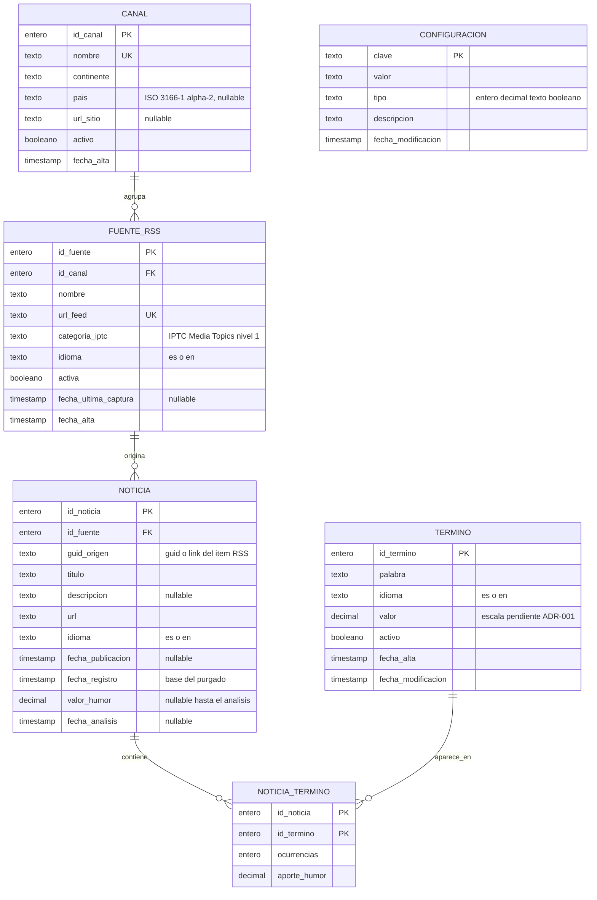

# MOD-01 — Modelo inicial de datos (E/R preliminar)

| Campo | Valor |
|---|---|
| **Identificador** | `MOD-01` |
| **Épica / Sprint** | EP-0 Infraestructura y arranque — Sprint 0 |
| **Responsable** | Matías Santos (Arquitectura y Documentación) |
| **Depende de** | `ADR-000` (arquitectura en tres capas) |
| **Bloquea** | `E1-H01`, `E1-H04`, `E4-H01`, `E2-H01-API` |
| **Estado** | Propuesta — pendiente de revisión por Backend (José Romero) |
| **Fecha** | 2026-08-25 |
| **Fuente** | Especificación HumWorld 260714, secc. 4.2.1 a 4.2.5, 4.3, 10.2 |

---

## 1. Alcance de este documento

### 1.1 Qué cierra MOD-01

Define las **entidades preliminares** del sistema, sus atributos, claves y cardinalidades, en un nivel **conceptual/lógico independiente del gestor de datos**. Es el insumo mínimo para que `E1-H01` (alta de canales y fuentes), `E1-H04` y `E4-H01` (parámetros vía `/config`) y `E2-H01-API` (CRUD del diccionario) puedan implementarse sin bloquearse entre sí.

Entidades cubiertas: **Canal**, **Fuente RSS**, **Noticia**, **Término** y **Configuración**, más la entidad asociativa **Noticia_Termino** (secc. 4.6), que el equipo adopta como parte del alcance del Sprint 1.

### 1.2 Qué NO cierra MOD-01

Este documento es deliberadamente agnóstico respecto de tres decisiones aún abiertas (ver secc. 8):

1. **Los tipos físicos del gestor de datos.** `ADR-003` ya fijó PostgreSQL 16 con SQLAlchemy y Alembic, pero este documento se mantiene en tipos genéricos (`texto`, `entero`, `decimal`, `timestamp`): la traducción a tipos SQL concretos y a migraciones vive en `backend/models/` y en Alembic, no aquí.
2. **El rango y la fórmula de agregación del valor de humor** — pendiente de `ADR-001`. El modelo reserva el campo numérico y su granularidad, no su escala.
3. **La métrica de "noticia influyente"** — pendiente de `ADR-002`. El modelo persiste los datos necesarios para calcularla, no la fórmula.

Tampoco define tablas de agregación precalculadas (humor por continente y fecha): en el modelo preliminar esas cifras se obtienen por consulta agregada sobre `NOTICIA` + `CANAL`. Si el rendimiento de los dashboards lo exige, se incorporarán en una revisión posterior del modelo.

---

## 2. Diagrama E/R

> `CONFIGURACION` aparece sin relaciones de forma intencionada: es una entidad de parámetros globales del sistema, no un dato de dominio asociado a ninguna otra entidad.

---

## 3. Entidades

### 3.1 CANAL

Medio de comunicación o fuente oficial. Es la unidad que aporta la **ubicación geográfica** al modelo: continente y país se declaran aquí y las noticias los heredan por navegación (regla R-M4).

| Atributo | Tipo | Obligatorio | Descripción |
|---|---|---|---|
| `id_canal` | entero | Sí | Clave primaria. |
| `nombre` | texto (150) | Sí | Nombre del medio. Único. |
| `continente` | texto | Sí | Dominio cerrado: `Africa`, `America`, `Antartida`, `Asia`, `Europa`, `Oceania`. |
| `pais` | texto (2) | No | Código ISO 3166-1 alpha-2. Nulo para medios sin país único (p. ej. agencias internacionales). |
| `url_sitio` | texto (500) | No | Sitio web del medio. |
| `activo` | booleano | Sí | Permite desactivar un canal sin borrar su histórico. Por defecto `true`. |
| `fecha_alta` | timestamp | Sí | Fecha de creación del registro. |

**Justificación de `pais`:** `E1-H01` solo exige nombre y continente, pero `E3-H03` (nube de palabras) y `T-DASH-01` exigen filtro por país. Sin este atributo el filtro no tiene origen de datos. Se define como opcional para no bloquear el alta de canales internacionales.

### 3.2 FUENTE_RSS

Feed concreto perteneciente a un canal. Un medio publica varios feeds (portada, deportes, economía), cada uno con su propia categoría IPTC.

| Atributo | Tipo | Obligatorio | Descripción |
|---|---|---|---|
| `id_fuente` | entero | Sí | Clave primaria. |
| `id_canal` | entero | Sí | FK a `CANAL`. |
| `nombre` | texto (150) | Sí | Nombre descriptivo del feed. |
| `url_feed` | texto (500) | Sí | URL del RSS. Única en todo el sistema. |
| `categoria_iptc` | texto | Sí | Primer nivel de IPTC Media Topics (17 valores; ver secc. 5.2). |
| `idioma` | texto (2) | Sí | `es` o `en`. Idioma declarado del feed; actúa como valor por defecto de sus noticias. |
| `activa` | booleano | Sí | `E1-H03` recorre únicamente fuentes activas. Por defecto `true`. |
| `fecha_ultima_captura` | timestamp | No | Última ejecución de captura sobre esta fuente (cron o manual). Nulo mientras no se haya capturado nunca. |
| `fecha_alta` | timestamp | Sí | Fecha de creación del registro. |

### 3.3 NOTICIA

Ítem capturado de un feed. Es la entidad de mayor volumen y la única sujeta a purgado.

| Atributo | Tipo | Obligatorio | Descripción |
|---|---|---|---|
| `id_noticia` | entero | Sí | Clave primaria. |
| `id_fuente` | entero | Sí | FK a `FUENTE_RSS`. |
| `guid_origen` | texto (500) | Sí | `guid` del ítem RSS; si el feed no lo publica, se usa el `link`. Base del control de duplicados. |
| `titulo` | texto (500) | Sí | Titular. |
| `descripcion` | texto largo | No | Resumen o `description` del ítem. Muchos feeds no lo incluyen. |
| `url` | texto (500) | Sí | Enlace a la noticia original. |
| `idioma` | texto (2) | Sí | `es` o `en`. Se hereda de la fuente y puede sobrescribirse si se detecta otro idioma. |
| `fecha_publicacion` | timestamp | No | `pubDate` del ítem. Nulo si el feed no la publica. |
| `fecha_registro` | timestamp | Sí | Fecha y hora en que el sistema almacenó la noticia (Especificación, secc. 4.2.4). **Es la fecha que usa el purgado**, no `fecha_publicacion`. |
| `valor_humor` | decimal | No | Valor de sentimiento calculado. **Nulo mientras la noticia no ha sido analizada.** |
| `fecha_analisis` | timestamp | No | Momento del cálculo del humor. |

**Sobre el estado de procesamiento:** no se añade un campo `estado`. `valor_humor IS NULL` identifica el conjunto de noticias pendientes de analizar, que es la única consulta que necesitan los Sprints 1 y 2. Si más adelante hace falta distinguir *pendiente* de *fallida* para reintentos, se incorpora el campo entonces, no ahora.

### 3.4 TERMINO

Entrada del diccionario de palabras evaluables (Especificación, secc. 4.2.2).

| Atributo | Tipo | Obligatorio | Descripción |
|---|---|---|---|
| `id_termino` | entero | Sí | Clave primaria. |
| `palabra` | texto (100) | Sí | Término normalizado (minúsculas, sin espacios en los extremos). |
| `idioma` | texto (2) | Sí | `es` o `en`. Un mismo lema puede existir en ambos idiomas con valores distintos. |
| `valor` | decimal | Sí | Peso del término. El ejemplo de la especificación (secc. 10.4) usa el rango −10 a +10; el rango definitivo lo fija `ADR-001`. |
| `activo` | booleano | Sí | Permite retirar un término del cálculo sin perder el histórico de `NOTICIA_TERMINO`. |
| `fecha_alta` | timestamp | Sí | Fecha de creación. |
| `fecha_modificacion` | timestamp | Sí | Última edición vía `PUT`/`PATCH /dictionary`. |

La unicidad es la pareja (`palabra`, `idioma`), no `palabra` sola.

### 3.5 CONFIGURACION

Parámetros globales expuestos por `GET`/`PUT /config`. Se modela como **clave-valor**, con un registro por parámetro.

| Atributo | Tipo | Obligatorio | Descripción |
|---|---|---|---|
| `clave` | texto (100) | Sí | Clave primaria. Identificador del parámetro. |
| `valor` | texto | Sí | Valor serializado como texto. |
| `tipo` | texto | Sí | `entero`, `decimal`, `texto` o `booleano`. Permite a la capa de lógica convertir y validar. |
| `descripcion` | texto (300) | Sí | Descripción legible del parámetro para el panel de administración. |
| `fecha_modificacion` | timestamp | Sí | Última modificación. |

**Parámetros iniciales:**

| Clave | Tipo | Valor por defecto | Historia |
|---|---|---|---|
| `captura.periodicidad_minutos` | entero | `60` | `E1-H04` |
| `noticias.caducidad_dias` | entero | `30` | `E4-H01` |

**Decisión y alternativa considerada.** El Backlog Final deja abierto (decisión pendiente n.º 5) si periodicidad y caducidad se modelan como una entidad de configuración única con múltiples campos o como parámetros independientes. Se propone la tercera vía —**una entidad única de tipo clave-valor**— porque: (a) `/config` es un único par `GET`/`PUT`, no un endpoint por parámetro; (b) añadir un parámetro nuevo no exige migración de esquema ni cambio de contrato; (c) el panel de administración (`E4-H04`) puede renderizar el formulario recorriendo los registros. El coste es que la validación de tipos y rangos vive en la capa de lógica de negocio y no en el esquema, lo cual es coherente con las reglas R-3 y R-4 de `ADR-000`. **Este es el punto que requiere confirmación explícita de Backend.**

### 3.6 NOTICIA_TERMINO (entidad asociativa)

Registra qué términos del diccionario aparecen en cada noticia y cuánto aportan al valor de humor.

| Atributo | Tipo | Obligatorio | Descripción |
|---|---|---|---|
| `id_noticia` | entero | Sí | FK a `NOTICIA`. Parte de la clave primaria compuesta. |
| `id_termino` | entero | Sí | FK a `TERMINO`. Parte de la clave primaria compuesta. |
| `ocurrencias` | entero | Sí | Número de apariciones del término en la noticia. |
| `aporte_humor` | decimal | Sí | Contribución del término al `valor_humor` de la noticia. |

Ver en la secc. 4.6 la justificación de por qué esta entidad existe.

---

## 4. Relaciones y cardinalidades

| # | Relación | Cardinalidad | Lectura |
|---|---|---|---|
| R1 | `CANAL` — `FUENTE_RSS` | 1 : N | Un canal agrupa una o más fuentes RSS. Toda fuente pertenece exactamente a un canal. |
| R2 | `FUENTE_RSS` — `NOTICIA` | 1 : N | Una fuente origina cero o más noticias. Toda noticia proviene exactamente de una fuente. |
| R3 | `NOTICIA` — `TERMINO` | N : M | Resuelta mediante `NOTICIA_TERMINO`. Una noticia contiene varios términos evaluables; un término aparece en varias noticias. |
| R4 | `CONFIGURACION` | — | Entidad aislada, sin relaciones. |

**4.5 — Participación.** `FUENTE_RSS` y `NOTICIA` tienen participación **total** en R1 y R2 respectivamente: no existe fuente huérfana ni noticia sin fuente. `CANAL` y `TERMINO` tienen participación **parcial**: pueden existir sin fuentes o sin apariciones.

**4.6 — Por qué existe `NOTICIA_TERMINO`.** Es la única entidad que va más allá de las cinco nombradas en el enunciado de `MOD-01`, y se propone por una razón concreta: `E3-H03` exige una nube de "términos más influyentes" **filtrable por continente y país**, y `T-DASH-01` exige una consulta que devuelva esos términos. Sin persistir las apariciones, cada carga del dashboard obligaría a re-tokenizar el texto de todas las noticias del filtro en tiempo de consulta. Persistirlas convierte esa vista en una agregación simple sobre `NOTICIA_TERMINO` + `NOTICIA` + `CANAL`. Además hace auditable el cálculo del humor: permite explicar por qué una noticia obtuvo su valor.

**Decisión adoptada.** El equipo incorpora `NOTICIA_TERMINO` al alcance del **Sprint 1**, junto con el resto del modelo. La alternativa —posponerla y resolver la nube de palabras por recálculo en tiempo de consulta— se descarta porque traslada a `E3-H03` y `T-DASH-01` (Sprint 3) un cambio de esquema sobre una tabla ya poblada, en el sprint con mayor carga de la planificación (41 puntos).

Consecuencia operativa: `E2-H02` (cálculo del humor) debe persistir las filas de `NOTICIA_TERMINO` en la misma transacción en que escribe `NOTICIA.valor_humor`, para que se cumpla R-M7.

---

## 5. Reglas de integridad, dominios e índices

### 5.1 Reglas de integridad

| Regla | Enunciado | Origen |
|---|---|---|
| R-M1 | `(id_fuente, guid_origen)` es único. Es el mecanismo de control de duplicados de la captura. | `E1-H03`, criterio 4 |
| R-M2 | `(palabra, idioma)` es único en `TERMINO`. | `E2-H01-API` |
| R-M3 | El purgado elimina noticias cuya `fecha_registro` es anterior a `ahora − noticias.caducidad_dias`. | Especificación, secc. 4.2.5 |
| R-M4 | El continente y el país de una noticia se obtienen por navegación `NOTICIA → FUENTE_RSS → CANAL`. No se duplican en `NOTICIA`. | `ADR-000`, R-3 |
| R-M5 | Borrar una `FUENTE_RSS` borra en cascada sus noticias y las filas asociadas de `NOTICIA_TERMINO`. Borrar un `CANAL` con fuentes activas se rechaza: el canal se desactiva, no se borra. | `E1-H01`, `E4-H03` |
| R-M6 | Desactivar un `TERMINO` (`activo = false`) no borra sus filas históricas en `NOTICIA_TERMINO`; solo lo excluye de cálculos futuros. | secc. 3.4 |
| R-M7 | El `valor_humor` de una noticia analizada es coherente con la suma de `aporte_humor` de sus filas en `NOTICIA_TERMINO`, según la fórmula que fije `ADR-001`. | Especificación, secc. 4.2.4, 10.4 |

### 5.2 Dominio de `categoria_iptc`

Primer nivel de IPTC Media Topics (17 valores): arts/culture/entertainment/media, conflict/war/peace, crime/law/justice, disaster/accident, economy/business/finance, education, environment, health, human interest, labour, lifestyle/leisure, politics, religion, science/technology, society, sport, weather.

Se modela como **atributo con dominio cerrado**, no como tabla catálogo: es una lista fija de un estándar externo, no se mantiene desde la aplicación y ninguna historia pide CRUD sobre ella. Si en el futuro se necesita el segundo nivel IPTC o metadatos por categoría, se promueve a entidad propia.

### 5.3 Índices previstos

| Entidad | Índice | Justificación |
|---|---|---|
| `NOTICIA` | `(id_fuente, guid_origen)` único | R-M1, control de duplicados en cada captura. |
| `NOTICIA` | `fecha_registro` | Purgado (`E4-H02`) y filtros por fecha de los dashboards. |
| `NOTICIA` | `valor_humor` | Selección de noticias pendientes (`IS NULL`) y de noticias influyentes. |
| `CANAL` | `continente`, `pais` | Agregación y filtros geográficos de `T-DASH-01`. |
| `FUENTE_RSS` | `url_feed` único | Evita dar de alta dos veces el mismo feed. |
| `TERMINO` | `(palabra, idioma)` único | R-M2 y búsqueda del diccionario. |

---

## 6. Trazabilidad

| Entidad / atributo | Historia o requisito | Especificación |
|---|---|---|
| `CANAL`, `FUENTE_RSS`, `categoria_iptc` | `E1-H01` | secc. 4.2.1 |
| Seed de fuentes por continente (`CANAL.continente`) | `E1-H02` | secc. 4.2.1 |
| `CONFIGURACION` → `captura.periodicidad_minutos` | `E1-H04` | secc. 4.2.3 |
| `NOTICIA`, `fecha_registro`, `guid_origen`, `FUENTE_RSS.activa` | `E1-H03`, `E1-H05` | secc. 4.2.3, 4.2.4 |
| `TERMINO` | `E2-H01-API`, `E2-H01-UI` | secc. 4.2.2, 10.2 |
| `NOTICIA.valor_humor`, `fecha_analisis`, `NOTICIA_TERMINO` | `E2-H02` | secc. 4.2.4 |
| `FUENTE_RSS.idioma`, `NOTICIA.idioma`, `TERMINO.idioma` | `E2-H03`, `R-02` | secc. 3, 4.4 |
| `CANAL.continente`, `CANAL.pais`, agregaciones | `E3-H01`, `T-DASH-01` | secc. 4.3.2 |
| `NOTICIA.valor_humor` (ordenación) | `E3-H02` | secc. 4.3.2 |
| `NOTICIA_TERMINO` | `E3-H03` | secc. 4.3.1 |
| `CONFIGURACION` → `noticias.caducidad_dias` | `E4-H01`, `E4-H02`, `E4-H03` | secc. 4.2.5 |
| `CONFIGURACION` (listado y edición) | `E4-H04` | secc. 4.3 |

Las cinco entidades del enunciado más la asociativa cubren los seis grupos de endpoints mínimos de la secc. 10.2, sin cobertura pendiente.

---

## 7. Encaje con ADR-000

El modelo vive íntegramente en la **capa de datos** (`backend/models/` y `backend/repositories/`, secc. 4.4 de `ADR-000`) y respeta sus reglas normativas:

- **R-3** — Los servicios de negocio no consultan el gestor de datos: acceden a estas entidades a través de repositorios.
- **R-4** — Ninguna entidad incorpora lógica de cálculo del humor; `valor_humor` y `aporte_humor` son resultados persistidos, no derivados en el modelo. El motor de sentimiento puede probarse en memoria sin base de datos.
- **R-6** — Ninguna entidad conoce HTTP ni RSS; la lectura de feeds ocurre en la capa de lógica de negocio.

---

## 8. Decisiones abiertas que este modelo no cierra

| # | Decisión | Impacto en el modelo | Dónde se resuelve |
|---|---|---|---|
| 1 | Rango y fórmula de agregación del humor | Escala y precisión de `TERMINO.valor`, `NOTICIA.valor_humor` y `NOTICIA_TERMINO.aporte_humor`. No afecta a entidades ni relaciones. | `ADR-001` |
| 2 | Métrica de "noticia influyente" | Puede exigir un atributo derivado adicional en `NOTICIA` (p. ej. número de términos evaluables) si la métrica no se resuelve con `valor_humor`. | `ADR-002` |
| ~~3~~ | ~~Gestor de datos (relacional vs. documental)~~ | **Cerrada el 2026-08-25: PostgreSQL 16 + SQLAlchemy 2.0 + Alembic** (`ADR-003`). `NOTICIA_TERMINO` se implementa como tabla puente; entidades, cardinalidades e índices del modelo se trasladan sin reinterpretación. | `ADR-003` |
| 4 | Modelado de `CONFIGURACION` como clave-valor | Confirmar o rechazar la propuesta de la secc. 3.5 (Backlog Final, decisión pendiente n.º 5). | Revisión de este documento |
| ~~5~~ | ~~Inclusión de `NOTICIA_TERMINO` en Sprint 1~~ | **Cerrada el 2026-08-25: se adopta en Sprint 1** (secc. 4.6). | — |

---

## 9. Revisión

Criterio de aceptación de `MOD-01` (Planificación de Sprints v2): *"Diagrama E/R inicial versionado en `/docs`, revisado por Backend"*.

| Paso | Responsable | Estado |
|---|---|---|
| Redacción del modelo y del diagrama | Matías Santos | Hecho |
| Versionado en `docs/uml/` | Matías Santos | Hecho |
| Cierre de la decisión 5 de la secc. 8 (`NOTICIA_TERMINO` entra en Sprint 1) | Matías Santos | Hecho |
| Revisión técnica | José Romero (Backend) | **Pendiente** |
| Cierre de la decisión 4 de la secc. 8 (`CONFIGURACION` clave-valor) | Matías Santos + José Romero | **Pendiente** |

---

*Documento MOD-01 — Proyecto HumWorld, Universidad Andrés Bello, curso Uso de IA en Ingeniería de Software 2026-27.*
